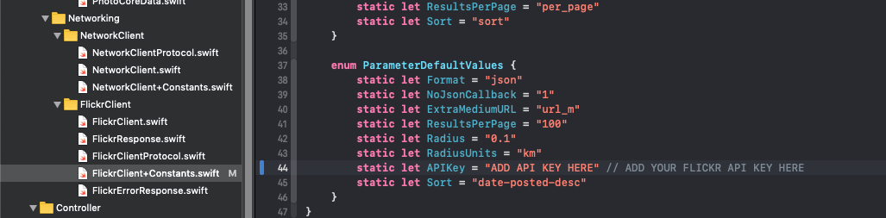

# Virtual-Tourist
Udacity portfolio app that allows users to place pins on the map and download images associated with the pin location using flickr's api.

# Usage
To use this app, you must first have a Flickr account, and a valid API key.

If you dont already have a Flickr account, you can get one [here](https://www.flickr.com).

## Apply for a Flickr API Key
Apply for an API key [here](https://www.flickr.com/services/apps/create/apply).

## Add the API key to the source code
Please add your API key to the [FlickrClient+Constants.swift](Virtual%20Tourist/Model/Networking/FlickrClient/FlickrClient+Constants.swift) file.

